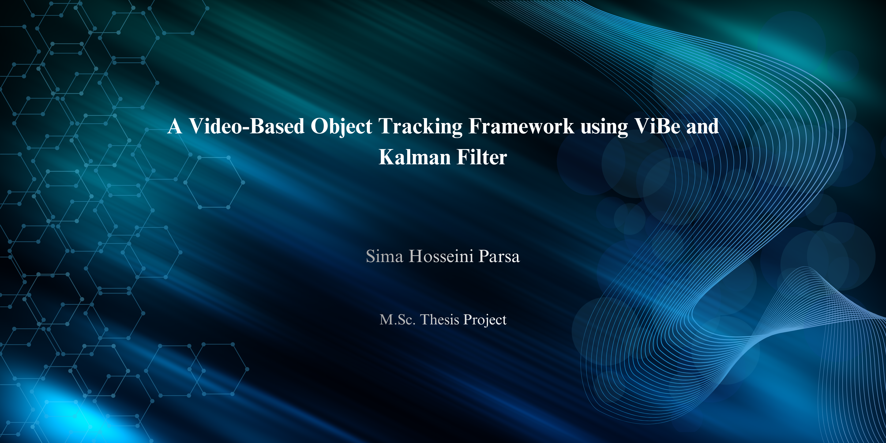
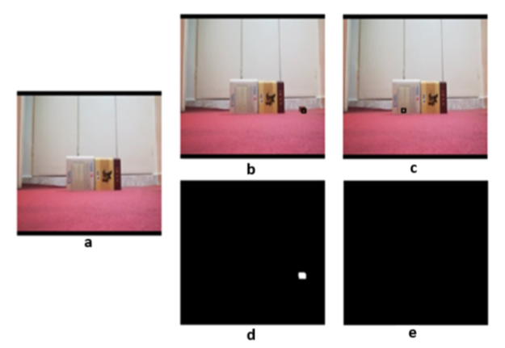
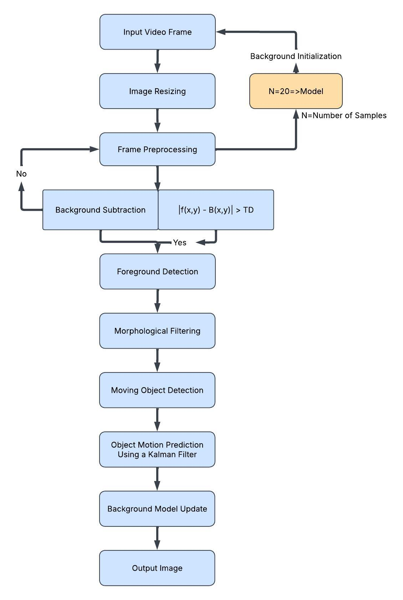
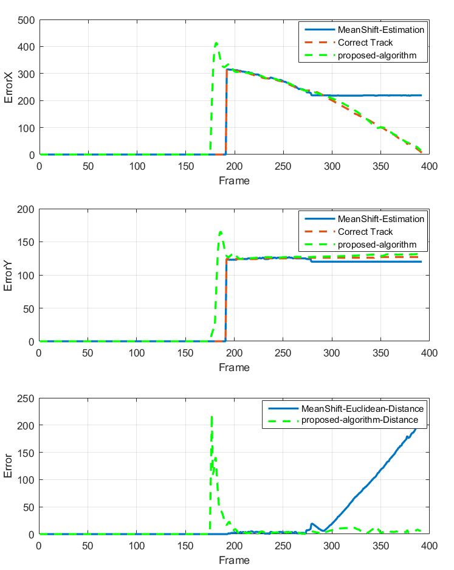

<p align="center">
  
</p>

# A Video-Based Object Tracking Framework using ViBe and Kalman Filter 

## Overview 

This project presents a video-based object tracking framework that combines ViBe background subtraction with a Kalman filter.
The system processes video sequences frame-by-frame and estimates object trajectories over time. The main objective is to improve the tracking performance of the classical ViBe algorithm by integrating a Kalman filter, without relying on deep learning models.

The implementation is developed in MATLAB and includes both modular and simplified versions to improve code readability and facilitate understanding of the proposed framework.
<p align="center">
  
</p>
<p align="center">
Results of the proposed algorithm on the Box video. (a) Background image without the moving object, (b) moving foreground object, (c) occlusion scenario with the object position estimated by the Kalman filter, (d) ground-truth tracking annotation corresponding to (b), and (e) ground-truth tracking annotation corresponding to the occlusion scenario in (c).
</p>

--- 

## Methodology 

The implementation is organized into modular MATLAB components: 

### ViBe Background Subtraction
- ViBeInitialization.m: Initializes the background model
- ViBeSegmentation.m: Performs foreground extraction
- ViBeUpdate.m: Updates the background model over time 

### Object Tracking
- KalmanTracker.m: Implements motion estimation using a Kalman filter

### Evaluation and Visualization
- Evaluation.m: Computes performance metrics against ground truth
- PlotResults.m: Generates plots and comparative visualizations 

### Main Pipeline
- Main.m: Controls the full video processing workflow 

<p align="center">
  
</p>
<p align="center">
Flowchart of the proposed algorithm.
</p>

--- 

## Dataset and Evaluation Setup 

The system is evaluated on three video sequences with available ground truth annotations. 

Performance is analyzed using: 

- Euclidean distance between predicted and ground truth positions
- x-y coordinate error analysis
- Runtime comparison with the classical ViBe and Mean Shift algorithms

--- 

## Results 

The tracking performance of the proposed method was evaluated using both trajectory comparison and distance-based error analysis. The estimated target coordinates obtained by the proposed algorithm and the conventional Mean Shift tracker were compared with the corresponding ground-truth bounding-box coordinates for each frame. The evaluation includes comparisons of the X- and Y-coordinate trajectories, followed by the Euclidean distance between the estimated target position and the ground truth to quantify the tracking accuracy throughout the video sequence.

<p align="center">
  
</p>
    
<p align="center">
Performance evaluation of the proposed tracking algorithm on the Box video. (a) Comparison of the estimated X-coordinate with the ground-truth trajectory, (b) comparison of the estimated Y-coordinate with the ground-truth trajectory, and (c) Euclidean distance between the estimated target position and the corresponding ground truth for the proposed algorithm and the conventional Mean Shift tracker.
</p>
<p align="center">
Processing time comparison among the classical ViBe algorithm, the proposed algorithm, and the Mean Shift tracker.
</p>

| Video | ViBe | Proposed | Mean Shift |
|-------|------:|---------:|-----------:|
| Box   | ~0.12 s | ~0.10 s | ~0.15 s |
| Car1  | ~0.012 s | ~0.009 s | ~0.10 s |
| Car2  | ~0.13 s | ~0.14 s | ~0.15 s |

--- 

## Discussion 

The proposed framework enhances the classical ViBe algorithm by integrating a Kalman filter for motion prediction, providing more stable object tracking and competitive performance compared with the classical ViBe and Mean Shift algorithms.

--- 

## Future Work 

Possible extensions of this work include: 

- Adaptive parameter estimation for improved robustness.
⦁	Enhanced performance in dynamic backgrounds and crowded scenes.
⦁	Improved handling of object scale variations.
⦁	Extension to more advanced motion models.
⦁	Investigation of potential applications in medical image and video analysis. 

--- 

## Project Structure

```text
├── src/
│   ├── Main.m
│   ├── ViBeInitialization.m
│   ├── ViBeSegmentation.m
│   ├── ViBeUpdate.m
│   ├── KalmanTracker.m
│   ├── Evaluation.m
│   └── PlotResults.m
│
├── compact_code/
│   └── ImprovedViBeSimplifiedVersion.m
│
├── inputs/
│   ├── videos/
│   │   ├── Box.wmv
│   │   ├── Car1.avi
│   │   └── Car2.avi
│   │
│   └── ground_truth/
│       ├── gtbox.txt
│       ├── gtcar1.txt
│       └── gtcar2.txt
│
├── images/
│   ├── Banner.png
│   ├── Box.png
│   ├── boxacuracy.png
│   └── flowchart.jpeg
│
├── Project_Report.pdf
├── Project_Summary.pdf
└── README.md
```

### Code Description

- **src/**: Modular implementation of the proposed algorithm. Each component is separated to improve readability, maintainability, and code organization.
- **compact_code/**: Contains a compact version of the implementation for easier understanding and quick reference while preserving the original processing pipeline.
- **inputs/**: Contains the input video sequences and their corresponding ground-truth annotation files.
- **Project_Report.pdf**: Detailed project report describing the methodology, implementation, and experimental results.
- **Project_Summary.pdf**: Concise overview of the project, methodology, and key findings.
--- 
## Installation

### Requirements

- MATLAB
- Image Processing Toolbox
- Computer Vision Toolbox

### Steps

1. Clone this repository.
2. Open the project in MATLAB.
3. Replace the placeholder filenames in `Main.m` with the paths to your input video and corresponding ground-truth file.
4. Run `Main.m`.
---
### Note
For simplicity, the sample input videos and their corresponding ground-truth files included in this repository have been renamed using standardized filenames.

- Box.wmv → gtbox.txt  
- Car1.avi → gtcar1.txt  
- Car2.avi → gtcar2.txt
## Final Notes 

This project focuses on classical computer vision techniques for object tracking and provides a foundation for future research in video analysis and intelligent tracking systems.
